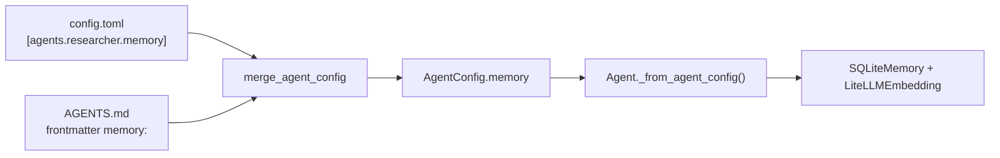
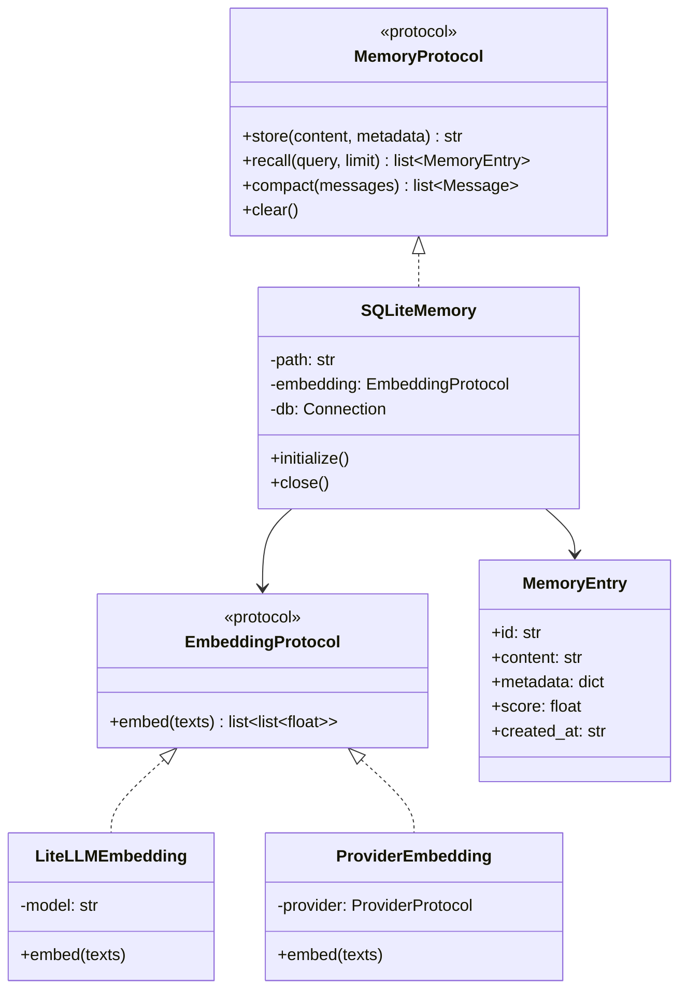
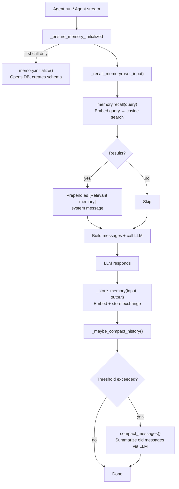

# Memory Management

Sage agents can maintain **persistent semantic memory** across conversations. When enabled, the agent automatically recalls relevant past exchanges before each LLM call and stores new exchanges after each response. This gives agents long-term context without manually managing conversation state.

The default implementation uses SQLite for storage and any [litellm-supported embedding model](https://docs.litellm.ai/docs/embedding/supported_embedding) for semantic search.

---

## Table of Contents

- [Quickstart](#quickstart)
- [Configuration Reference](#configuration-reference)
- [How It Works](#how-it-works)
- [Contributing](#contributing)
- [Troubleshooting](#troubleshooting)
- [Logging Reference](#logging-reference)

---

## Quickstart

### 1. Add Memory Config

In `config.toml`, add a `[agents.<name>.memory]` section:

```toml
[agents.researcher.memory]
backend = "sqlite"
path = "memory.db"
embedding = "text-embedding-3-large"
compaction_threshold = 50
# vector_search = "auto"   # default: use sqlite-vec if available, numpy fallback
```

Or in your agent's `.md` frontmatter:

```yaml
---
name: researcher
model: azure_ai/gpt-4o
memory:
  backend: sqlite
  path: memory.db
  embedding: text-embedding-3-large
  compaction_threshold: 50
  # vector_search: auto   # default
---
```

### 2. Set Embedding Credentials

The embedding model needs API credentials. Set the appropriate environment variables for your provider:

```bash
# OpenAI
export OPENAI_API_KEY="sk-..."

# Azure AI Foundry
export AZURE_AI_API_KEY="your-key"
export AZURE_AI_API_BASE="https://your-endpoint.models.ai.azure.com"
```

### 3. Run the Agent

Memory initializes automatically on first use. No extra code or flags required.

```bash
sage agent run agents/researcher/ --input "What is the CAP theorem?"
```

### 4. Verify

Run with verbose logging to confirm memory is active:

```bash
sage agent run agents/researcher/ -v --input "What is the CAP theorem?"
```

You should see log lines like:

```
INFO  Building memory backend for 'researcher': backend=sqlite, embedding=text-embedding-3-large, path=memory.db
INFO  Initializing memory for agent 'researcher'
INFO  Opening memory database at memory.db
```

---

## Configuration Reference

### Memory Fields

| Field | Type | Default | Description |
|-------|------|---------|-------------|
| `backend` | `str` | `"sqlite"` | Memory backend type. Currently only `"sqlite"` is implemented. |
| `path` | `str` | `"memory.db"` | Path to the SQLite database file. Relative paths are resolved from the working directory. |
| `embedding` | `str` | `"text-embedding-3-large"` | Any litellm-compatible embedding model string. |
| `compaction_threshold` | `int` | `50` | Number of conversation messages before history compaction triggers. |
| `vector_search` | `"auto"` \| `"sqlite_vec"` \| `"numpy"` | `"auto"` | Vector search backend. `"auto"` uses sqlite-vec when available (O(log n) ANN) and falls back to numpy (O(n) cosine). `"sqlite_vec"` requires the `sage-agent[vec]` optional dep. `"numpy"` forces the numpy path even when sqlite-vec is installed. |

### Config Sources and Priority

Memory can be configured in two places. Higher priority wins:

```
[defaults]          (lowest)  - memory is NOT available in defaults
[agents.<name>]     (medium)  - config.toml per-agent section
Agent .md frontmatter (highest) - YAML frontmatter in the agent file
```

> **Note**: Memory is an agent-only field. It cannot be set in the `[defaults]` section because memory configuration is inherently per-agent (different agents may need different databases or embedding models).

### Config Resolution Flow



### Embedding Model Examples

The `embedding` field accepts any model string that [litellm supports](https://docs.litellm.ai/docs/embedding/supported_embedding):

| Provider | Model String | Env Vars Required |
|----------|-------------|-------------------|
| OpenAI | `text-embedding-3-large` | `OPENAI_API_KEY` |
| OpenAI | `text-embedding-3-small` | `OPENAI_API_KEY` |
| Azure OpenAI | `azure/my-embedding-deployment` | `AZURE_API_KEY`, `AZURE_API_BASE` |
| Azure AI Foundry | `azure_ai/text-embedding-3-large` | `AZURE_AI_API_KEY`, `AZURE_AI_API_BASE` |
| Cohere | `embed-english-v3.0` | `COHERE_API_KEY` |

### Related: Context Management

The `[defaults.context]` section controls token-aware compaction that works alongside memory's message-count compaction:

```toml
[defaults.context]
compaction_threshold = 0.75   # compact at 75% of context window
reserve_tokens = 4096         # tokens reserved for model output
prune_tool_outputs = true     # truncate large tool outputs
tool_output_max_chars = 5000  # max chars per tool output
```

When both are configured, compaction triggers on whichever threshold is hit first (message count or token percentage).

---

## How It Works

### Architecture

The memory subsystem is built on two protocols that define clean extension points:



### Runtime Lifecycle

Each agent run follows this sequence:



### Recall: Semantic Search

When the agent recalls memory, the process is:

1. The user's input is embedded into a vector using the configured embedding model.
2. The top-k nearest neighbours are retrieved — either via sqlite-vec ANN search (O(log n), when available) or numpy cosine similarity across all rows (O(n) fallback).
3. The top results (default: 5) are returned, ranked by score.

**sqlite-vec ANN search** (default when `sqlite-vec` is installed):

```bash
pip install sage-agent[vec]   # installs sqlite-vec
```

On `initialize()`, sage attempts to load the `sqlite-vec` extension and creates a `memory_vec` virtual table alongside the main `memories` table. If the extension is unavailable (not installed, or SQLite compiled without `SQLITE_ENABLE_LOAD_EXTENSION`), the numpy path is used transparently.

The recalled memories are injected as a system message before the conversation history:

```
[System: agent body + skills]
[System: [Relevant memory]
- User: What is CAP? Assistant: CAP theorem states...
- User: Explain ACID. Assistant: ACID stands for...]
[... conversation history ...]
[User: new input]
```

### Storage: What Gets Stored

After each successful response, the agent stores the exchange as a single string:

```
User: <input>
Assistant: <output>
```

This is embedded and stored with an auto-generated UUID and timestamp. Metadata can be attached when using the API directly.

### Storage Schema

The SQLite database contains the main memories table, and optionally a sqlite-vec virtual table:

```sql
CREATE TABLE IF NOT EXISTS memories (
    id         TEXT PRIMARY KEY,   -- UUID hex (32 chars)
    content    TEXT NOT NULL,      -- "User: ...\nAssistant: ..."
    embedding  BLOB,              -- float32 numpy array as bytes
    metadata   TEXT DEFAULT '{}', -- JSON string
    created_at TEXT NOT NULL       -- ISO 8601 UTC timestamp
);

-- Created only when sqlite-vec extension is available:
CREATE VIRTUAL TABLE IF NOT EXISTS memory_vec
USING vec0(embedding float[N]);   -- N = embedding dimension
```

When sqlite-vec is active, each `store()` inserts into both tables (using the memories row's `rowid` as the foreign key). `recall()` uses `vec_distance_cosine` for O(log n) ANN retrieval; `clear()` deletes from both tables atomically.

### Compaction

Compaction prevents unbounded conversation history growth. Two mechanisms work together:

**Message-count compaction** (from memory config):
- Triggers when `len(conversation_history) > compaction_threshold` (default: 50)
- Summarizes the oldest messages via an LLM call
- Keeps the most recent 10 messages verbatim
- Preserves all system messages

**Token-aware compaction** (from context config):
- Triggers when token usage exceeds `compaction_threshold` fraction of the context window (default: 75%)
- Uses the same summarization strategy
- Requires `[defaults.context]` to be configured

Both wait at least 2 turns between compactions to avoid thrashing.

**Tool output pruning** runs independently:
- Truncates tool outputs longer than `tool_output_max_chars` in older messages
- Preserves full output in the most recent 10 messages

---

## Contributing

### Code Map

| File | Purpose |
|------|---------|
| `sage/memory/base.py` | `MemoryProtocol` and `MemoryEntry` definitions |
| `sage/memory/embedding.py` | `EmbeddingProtocol`, `LiteLLMEmbedding`, `ProviderEmbedding` |
| `sage/memory/sqlite_backend.py` | `SQLiteMemory` implementation (store, recall, cosine search) |
| `sage/memory/compaction.py` | `compact_messages()` and `prune_tool_outputs()` |
| `sage/memory/__init__.py` | Public API exports |
| `sage/agent.py` | Memory integration (init, recall, store, compact lifecycle) |
| `sage/config.py` | `MemoryConfig` model and config logging |

### Adding a New Memory Backend

1. **Create your backend class** implementing `MemoryProtocol`:

```python
# sage/memory/my_backend.py
from sage.memory.base import MemoryEntry, MemoryProtocol
from sage.memory.embedding import EmbeddingProtocol

class MyMemory:
    """Custom memory backend."""

    def __init__(self, *, embedding: EmbeddingProtocol, **kwargs) -> None:
        self._embedding = embedding
        # ... your init

    async def initialize(self) -> None:
        """Set up connections/schema."""
        ...

    async def store(self, content: str, metadata: dict | None = None) -> str:
        """Store content, return a unique ID."""
        ...

    async def recall(self, query: str, limit: int = 5) -> list[MemoryEntry]:
        """Return top matches ranked by similarity."""
        ...

    async def compact(self, messages: list) -> list:
        """Pass-through (compaction is handled by compact_messages)."""
        return messages

    async def clear(self) -> None:
        """Delete all stored memories."""
        ...

    async def close(self) -> None:
        """Release resources."""
        ...
```

2. **Wire it into agent construction** in `sage/agent.py`, inside `_from_agent_config()`:

```python
if config.memory is not None:
    if config.memory.backend == "sqlite":
        # ... existing code
    elif config.memory.backend == "my_backend":
        from sage.memory.my_backend import MyMemory
        memory = MyMemory(embedding=embedding, ...)
```

3. **Update `MemoryConfig`** in `sage/config.py` if new fields are needed.

4. **Add tests** following the pattern in `tests/test_memory/test_sqlite.py`.

### Adding a New Embedding Provider

There are three approaches, from simplest to most custom:

**Option A: Use `LiteLLMEmbedding` with a different model string** (no code changes):

```toml
[agents.my_agent.memory]
embedding = "cohere/embed-english-v3.0"
```

**Option B: Use `ProviderEmbedding`** to reuse the agent's LLM provider credentials:

```python
from sage.memory.embedding import ProviderEmbedding
from sage.providers.litellm_provider import LiteLLMProvider

provider = LiteLLMProvider("azure/Cohere-embed-v3-english", api_key="...")
embedding = ProviderEmbedding(provider)
```

**Option C: Implement `EmbeddingProtocol`** for a custom provider:

```python
from sage.memory.embedding import EmbeddingProtocol

class MyEmbedding:
    async def embed(self, texts: list[str]) -> list[list[float]]:
        # Call your embedding service
        ...
```

The protocol is runtime-checkable, so `isinstance(obj, EmbeddingProtocol)` works for validation.

### Testing Patterns

Memory tests live in `tests/test_memory/` and use a `DeterministicEmbedding` helper that produces reproducible vectors from SHA-256 hashes. This avoids API calls in tests while still exercising the full store/recall/similarity pipeline.

```python
class DeterministicEmbedding:
    """SHA-256 based embedding for reproducible tests."""

    async def embed(self, texts: list[str]) -> list[list[float]]:
        result = []
        for text in texts:
            digest = hashlib.sha256(text.encode()).digest()
            raw = np.array([b / 255.0 for b in digest[:8]], dtype=np.float64)
            norm = np.linalg.norm(raw)
            vec = (raw / norm if norm > 0 else raw).tolist()
            result.append(vec)
        return result
```

When adding a new backend, test at minimum:
- `store()` returns a valid ID
- `recall()` ranks exact matches highest
- `recall()` respects the `limit` parameter
- `clear()` removes all entries
- Operations before `initialize()` raise `SageMemoryError`
- Close and reopen preserves data (if persistent)

Run memory tests:

```bash
pytest tests/test_memory/ -v
```

---

## Troubleshooting

| Symptom | Cause | Fix |
|---------|-------|-----|
| `SageMemoryError: Database not initialized` | `memory.initialize()` was not called before `store()`/`recall()` | This happens automatically via `_ensure_memory_initialized()` in `Agent`. If using `SQLiteMemory` directly, call `await memory.initialize()` first. |
| `AuthenticationError` from embedding call | Missing or invalid API key for the embedding model | Set the correct env vars for your embedding provider (see [Embedding Model Examples](#embedding-model-examples)). |
| Memory not being recalled | No stored memories yet, or embedding model mismatch | Run with `-v` to see recall logs. Check that the embedding model matches what was used during storage. If you change models, clear the DB (`await memory.clear()`) and re-populate. |
| Slow recall on large databases | sqlite-vec not installed; numpy O(n) scan is in use | Install `pip install sage-agent[vec]` to enable O(log n) ANN search. Check verbose logs for `"sqlite-vec ANN search enabled"` to confirm. On platforms where SQLite is compiled without `SQLITE_ENABLE_LOAD_EXTENSION`, the numpy fallback is automatic. |
| `memory.db` file not created | Memory not configured or config not reaching the agent | Check that `[agents.<name>.memory]` is uncommented in `config.toml` and the agent name matches. Run with `-v` to see config loading logs. |
| Compaction not triggering | Message count below threshold | Default threshold is 50. Lower `compaction_threshold` to trigger earlier, or check if token-aware compaction is also configured. |
| `litellm.exceptions.BadRequestError` | Embedding model string not recognized by litellm | Verify the model string against [litellm's embedding docs](https://docs.litellm.ai/docs/embedding/supported_embedding). |

---

## Logging Reference

All memory logging uses Python's standard `logging` module. Run with `-v` for DEBUG-level output.

### INFO Level (visible by default)

| Log Message | Source | When |
|-------------|--------|------|
| `Building memory backend for '<agent>': backend=..., embedding=..., path=...` | `sage.agent` | Agent constructed from config with memory enabled |
| `Initializing memory for agent '<agent>'` | `sage.agent` | First run/stream call |
| `Memory initialized for agent '<agent>'` | `sage.agent` | Database ready |
| `Opening memory database at <path>` | `sage.memory.sqlite_backend` | Database connection opened |
| `Memory database schema ensured` | `sage.memory.sqlite_backend` | Schema created or verified |
| `Clearing all stored memories` | `sage.memory.sqlite_backend` | `memory.clear()` called |
| `Compaction triggered: summarizing N message(s), keeping N recent` | `sage.memory.compaction` | History exceeded threshold |
| `Compaction complete: before=N, after=N` | `sage.memory.compaction` | Summarization finished |
| `Compacting history for agent '<agent>': N messages before compaction` | `sage.agent` | Agent-level compaction start |
| `History compacted for agent '<agent>': N -> N messages` | `sage.agent` | Agent-level compaction complete |
| `memory: backend=..., path=..., embedding=..., compaction_threshold=..., vector_search=...` | `sage.config` | Config loaded with memory section |

### DEBUG Level (visible with `-v`)

| Log Message | Source | When |
|-------------|--------|------|
| `Recalling memory for agent '<agent>': query=...` | `sage.agent` | Before each recall |
| `Memory recall for agent '<agent>': N result(s), top_score=...` | `sage.agent` | After successful recall |
| `Memory recall for agent '<agent>': no results` | `sage.agent` | Empty recall |
| `Memory stored for agent '<agent>': id=..., content_len=...` | `sage.agent` | After successful store |
| `Embedding N text(s) via model=...` | `sage.memory.embedding` | Before embedding API call |
| `Embedding complete: N vector(s), dimensions=...` | `sage.memory.embedding` | After embedding API call |
| `sqlite-vec ANN search enabled (dim=N)` | `sage.memory.sqlite_backend` | sqlite-vec extension loaded successfully |
| `sqlite-vec unavailable (...), using numpy fallback` | `sage.memory.sqlite_backend` | Extension load failed; numpy will be used |
| `Recalling memories: query_preview=..., limit=...` | `sage.memory.sqlite_backend` | Before vector search |
| `Recall complete (numpy): candidates=N, returned=N, top_scores=[...]` | `sage.memory.sqlite_backend` | After numpy cosine search |
| `Recall complete (sqlite-vec): returned=N, top_scores=[...]` | `sage.memory.sqlite_backend` | After sqlite-vec ANN search |
| `Stored memory id=..., content_preview=...` | `sage.memory.sqlite_backend` | After DB insert |
| `Closing memory database connection` | `sage.memory.sqlite_backend` | Database closing |
| `Compaction skipped: message count N <= threshold N` | `sage.memory.compaction` | Below threshold |
| `Pruned N oversized tool output(s)` | `sage.memory.compaction` | Tool outputs truncated |
| `LiteLLMEmbedding initialized with model=...` | `sage.memory.embedding` | Embedding provider created |

---

## Further Reading

- [ADR-004: SQLite as Default Memory Backend](adrs/004-sqlite-memory-default.md) - Design rationale and trade-offs
- [Memory Agent Example](../examples/memory_agent/) - Working example with Cohere embeddings
- [litellm Embedding Docs](https://docs.litellm.ai/docs/embedding/supported_embedding) - Supported embedding models
