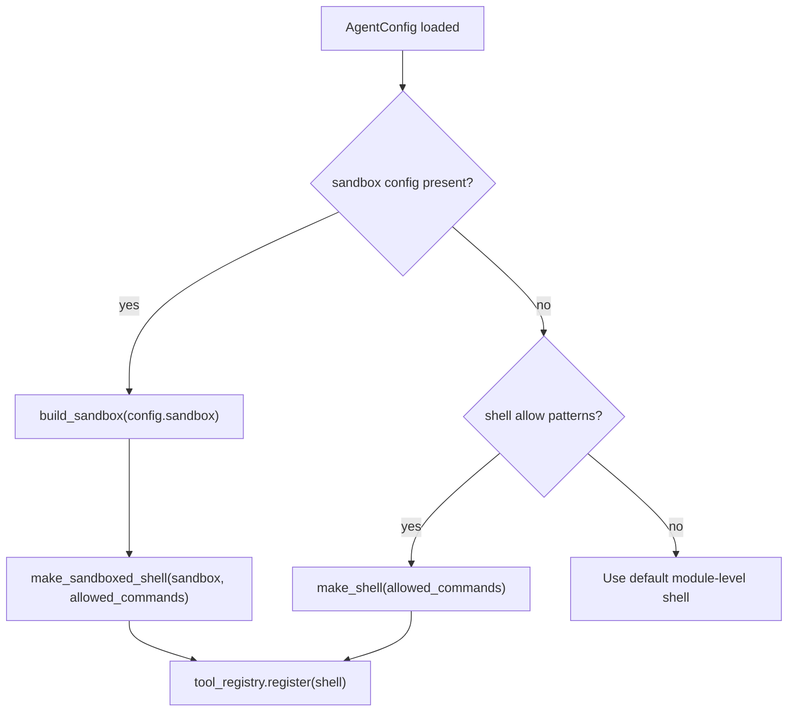

# Sandboxing

Sage agents execute shell commands on behalf of an LLM. Without containment, a hallucinating or prompt-injected model can run destructive commands (`rm -rf /`), exfiltrate data (`curl ... -d @/etc/passwd`), or access credentials (`cat ~/.ssh/id_rsa`). Sandboxing provides **defense-in-depth** — multiple independent layers that each reduce the blast radius of a compromised command.

The current regex-based blocklist is trivially bypassable (e.g., `python3 -c "import shutil; shutil.rmtree('/')"` is not caught). Sandboxing adds OS-level enforcement that cannot be bypassed from within the shell.

---

## Table of Contents

- [Quickstart](#quickstart)
- [Security Model](#security-model)
- [Backends](#backends)
- [Configuration Reference](#configuration-reference)
- [When to Use What](#when-to-use-what)
- [How It Works](#how-it-works)
- [Limitations](#limitations)
- [Troubleshooting](#troubleshooting)

---

## Quickstart

### 1. Enable Sandbox in Agent Config

Add a `sandbox:` section to your agent's `AGENTS.md` frontmatter:

```yaml
---
name: devtools
model: azure_ai/gpt-4o
sandbox:
  enabled: true
  backend: auto
---
```

`backend: auto` detects the best available backend for your platform:
- **Linux** with `bwrap` installed → Bubblewrap (namespace isolation)
- **macOS** → Seatbelt (`sandbox-exec`)
- **Fallback** → Native (environment sanitization only)

### 2. Run the Agent

No code changes required. The sandbox activates automatically when the agent is constructed:

```bash
sage agent run agents/devtools/ --input "List files in the current directory"
```

### 3. Verify

Run with verbose logging to confirm the sandbox is active:

```bash
sage agent run agents/devtools/ -v --input "echo hello"
```

You should see log lines like:

```
DEBUG shell (sandboxed): echo hello
```

---

## Security Model

Sage uses a three-layer security model. Each layer is independent — a bypass at one layer is still blocked by the others.

```
┌─────────────────────────────────────────────────┐
│  Layer 1: Regex Blocklist (application-level)   │
│  Blocks known-dangerous patterns before exec.   │
│  Fast-fail, defense-in-depth, not airtight.     │
├─────────────────────────────────────────────────┤
│  Layer 2: Environment Sanitization              │
│  Strips $SHELL, $BASH_FUNC_*, and all inherited │
│  env vars except PATH, HOME, USER, LANG, TERM.  │
│  Blocks env-var injection and function export    │
│  bypass vectors.                                │
├─────────────────────────────────────────────────┤
│  Layer 3: OS-Level Isolation                    │
│  Linux namespaces (bwrap), macOS Seatbelt, or   │
│  Docker containers. Read-only filesystem,       │
│  writable workspace only, optional network      │
│  restriction.                                   │
└─────────────────────────────────────────────────┘
```

### What each layer protects against

| Threat | Layer 1 (Regex) | Layer 2 (Env) | Layer 3 (OS) |
|--------|:---:|:---:|:---:|
| `rm -rf /` | Blocked | - | Read-only FS |
| `python3 -c "shutil.rmtree('/')"` | Not caught | - | Read-only FS |
| `curl ... -d @/etc/passwd` | Blocked | - | Network deny (if configured) |
| `$SHELL -c "malicious"` | Not caught | `$SHELL` stripped | - |
| `BASH_FUNC_*` export injection | Not caught | Stripped | Cleared env |
| Write to `~/.ssh/authorized_keys` | Not caught | - | Read-only FS |
| Read `~/.aws/credentials` | Not caught | - | `deny_read` hides path |
| Fork bomb | Not caught | - | PID limit (Docker) |

Layer 1 is always active. Layers 2 and 3 require `sandbox.enabled: true`.

---

## Backends

### Native

**Environment sanitization only.** No OS-level isolation. Runs on all platforms.

- Strips all inherited environment variables
- Passes through only: `PATH`, `HOME`, `USER`, `LANG`, `TERM` (plus any `allowed_env`)
- Replaces `PATH` with a trusted value: `/usr/local/bin:/usr/bin:/bin`
- Blocks `$SHELL` bypass, `BASH_FUNC_*` export injection, and env-var exfiltration

This is the default backend and the fallback when no OS-level sandbox is available.

```yaml
sandbox:
  enabled: true
  backend: native
```

### Bubblewrap (Linux)

**Linux namespace isolation** via [bubblewrap](https://github.com/containers/bubblewrap). Provides filesystem, PID, and optional network isolation without root privileges.

Requires `bwrap` to be installed:

```bash
# Debian/Ubuntu
sudo apt install bubblewrap

# Fedora
sudo dnf install bubblewrap

# Arch
sudo pacman -S bubblewrap
```

What it does:
- Mounts the root filesystem **read-only** (`--ro-bind / /`)
- Mounts the workspace directory **read-write** (`--bind <workspace> <workspace>`)
- Mounts additional `writable_roots` paths read-write (default: `/tmp`)
- Hides `deny_read` paths with empty tmpfs overlays (default: `~/.ssh`, `~/.aws`, `~/.gnupg`)
- Isolates PIDs (`--unshare-pid`) so the command cannot signal other processes
- Creates a new session (`--new-session`) to detach from the terminal
- Child dies with parent (`--die-with-parent`) to prevent orphaned processes
- Clears all environment variables (`--clearenv`) then re-exports the safe minimum
- Optionally isolates network (`--unshare-net` when `network: false`)

```yaml
sandbox:
  enabled: true
  backend: bubblewrap
  network: false
  deny_read: ["~/.ssh", "~/.aws", "~/.gnupg", "~/.config/gcloud"]
```

### Seatbelt (macOS)

**macOS sandbox** using the built-in `sandbox-exec` with a dynamically generated Seatbelt profile. No installation required — `sandbox-exec` ships with macOS.

What it does:
- Starts from `(allow default)` — permits most operations
- Denies all file writes outside the workspace and `/tmp`
- Optionally denies all network access (`network: false`)

```yaml
sandbox:
  enabled: true
  backend: seatbelt
  network: true
```

> **Note:** Apple deprecated `sandbox-exec` in macOS 10.15 but it remains functional through macOS 15. There is no public replacement API for command-line sandboxing.

### Docker

**Strongest isolation** — runs commands in ephemeral Docker containers with resource limits. Best for eval/benchmark scenarios where maximum containment is required.

Requires Docker to be installed and running.

What it does:
- Runs in a fresh container per command (`--rm`)
- Read-only root filesystem (`--read-only`)
- Workspace mounted read-write (`--volume=<workspace>:/workspace:rw`)
- Writable `/tmp` via tmpfs (`--tmpfs /tmp:size=512m`)
- Memory limit: 512MB (`--memory=512m`)
- CPU limit: 0.5 cores (`--cpus=0.5`)
- PID limit: 100 processes (`--pids-limit=100`)
- Network disabled by default (`--network=none`)
- Default image: `python:3.11-slim`

```yaml
sandbox:
  enabled: true
  backend: docker
  network: false
  timeout: 60.0
```

To use a custom Docker image:

```python
# Programmatic usage
from sage.tools._sandbox import DockerSandbox
sandbox = DockerSandbox(image="node:20-slim", network=False)
```

---

## Configuration Reference

All sandbox fields go under the `sandbox:` key in agent frontmatter or `config.toml`.

| Field | Type | Default | Description |
|-------|------|---------|-------------|
| `enabled` | `bool` | `false` | Must be `true` to activate sandboxing. When `false`, the default unsandboxed shell is used. |
| `backend` | `str` | `"native"` | Sandbox implementation: `auto`, `native`, `bubblewrap`, `seatbelt`, `docker`, or `none`. |
| `mode` | `str` | `"workspace-write"` | Access level: `read-only`, `workspace-write`, or `full-access`. |
| `workspace` | `path` | `cwd` | Root path the agent may write to. Relative paths resolve from the working directory. |
| `writable_roots` | `list[str]` | `["/tmp"]` | Additional writable paths (bubblewrap only). |
| `deny_read` | `list[str]` | `["~/.ssh", "~/.aws", "~/.gnupg"]` | Paths hidden from the sandbox (bubblewrap only). Replaced with empty tmpfs. |
| `allowed_env` | `list[str]` | `[]` | Extra environment variables to pass through beyond the built-in allowlist (`PATH`, `HOME`, `USER`, `LANG`, `TERM`). |
| `network` | `bool` | `true` | Allow network access. Set `false` to block outbound connections. |
| `timeout` | `float` | `30.0` | Per-command timeout in seconds. Commands exceeding this are killed. |

### Backend Auto-Detection

When `backend: auto`:

1. **Linux** + `bwrap` on PATH → `bubblewrap`
2. **macOS** + `sandbox-exec` on PATH → `seatbelt`
3. **Otherwise** → `native`

### Full Example

```yaml
---
name: devtools
model: azure_ai/gpt-4o
permission:
  read: allow
  edit: allow
  shell:
    "*": allow
    "python *": allow
    "python3 *": allow
  web: allow
  git: allow
sandbox:
  enabled: true
  backend: auto
  mode: workspace-write
  workspace: .
  writable_roots: ["/tmp"]
  deny_read: ["~/.ssh", "~/.aws", "~/.gnupg"]
  allowed_env: ["VIRTUAL_ENV", "PYTHONPATH"]
  network: true
  timeout: 30.0
---
```

### Config Sources and Priority

```
Agent .md frontmatter    — YAML frontmatter in the agent file
```

Sandbox settings are currently agent-local only. They are defined in the
agent's Markdown frontmatter rather than in `config.toml`.

---

## When to Use What

| Scenario | Recommended Backend | Why |
|----------|-------------------|-----|
| **Local development** | `native` or `auto` | Low friction, blocks env-var attacks |
| **CI / automated runs** | `bubblewrap` (Linux) | Filesystem + PID isolation without Docker overhead |
| **Eval / benchmarks** | `docker` | Strongest isolation, resource limits, reproducible |
| **macOS development** | `seatbelt` or `auto` | Uses built-in macOS sandbox, no install required |
| **Trusted internal agents** | `none` or omit `sandbox:` | Skip sandbox overhead when the agent only runs trusted commands |
| **Untrusted user input** | `docker` with `network: false` | Maximum containment for adversarial input |

### Decision Flowchart

```
Is the agent running untrusted / user-provided input?
├─ Yes → Use docker with network: false
└─ No
   ├─ Is the agent running in CI?
   │  ├─ Yes → Use bubblewrap (Linux) or auto
   │  └─ No
   │     ├─ Do you need filesystem write protection?
   │     │  ├─ Yes → Use bubblewrap or seatbelt
   │     │  └─ No → Use native (env sanitization is enough)
   │     └─ Running on macOS?
   │        ├─ Yes → auto detects seatbelt
   │        └─ No → auto detects bubblewrap or falls back to native
```

---

## How It Works

### Agent Wiring

When an agent is constructed via `Agent._from_agent_config()`, the sandbox is wired in automatically:



The factory functions `make_sandboxed_shell()` and `make_shell()` produce `@tool`-decorated async callables that replace the module-level `shell` tool in the agent's `ToolRegistry`.

### Command Execution Flow

```
Agent calls shell(command="ls -la")
    │
    ├─ _validate_shell_command(command, allowed_commands)
    │   ├─ Check fnmatch allow patterns → bypass blocklist if matched
    │   ├─ Check regex blocklist on full command
    │   └─ Check regex blocklist on each chained segment (&&, ||, ;, |)
    │
    ├─ If blocked → raise ToolError("Command rejected")
    │
    └─ If passed → sandbox.execute(command)
        ├─ NativeSandbox: subprocess with sanitized env dict
        ├─ BubblewrapSandbox: bwrap with namespace flags
        ├─ SeatbeltSandbox: sandbox-exec with generated profile
        └─ DockerSandbox: docker run --rm with resource limits
```

### Environment Sanitization

All backends (including Docker) start from a clean environment. The `NativeSandbox` class handles this:

```python
_ALLOWED_ENV_VARS = {"PATH", "HOME", "USER", "LANG", "TERM"}
```

Only these variables are passed through. `PATH` is replaced with `/usr/local/bin:/usr/bin:/bin`. All other inherited variables — including `SHELL`, `BASH_FUNC_*`, `LD_PRELOAD`, etc. — are stripped.

Additional variables can be passed through via `allowed_env`:

```yaml
sandbox:
  enabled: true
  allowed_env: ["VIRTUAL_ENV", "PYTHONPATH", "NODE_PATH"]
```

### Interaction with Shell Permission Patterns

The sandbox and the shell blocklist bypass work together. When `permission.shell` uses the dict form with fnmatch patterns:

```yaml
permission:
  shell:
    "*": allow
    "python *": allow
    "python3 *": allow
```

Commands matching `"python *"` or `"python3 *"` bypass the regex blocklist (which would otherwise block `python3 -c ...`), but still run inside the sandbox. The sandbox provides OS-level protection even for explicitly allowed commands.

---

## Limitations

- **`native` backend** provides no filesystem or network isolation — only environment sanitization. A command like `python3 -c "import os; os.remove('/important')"` is not blocked by the native backend alone.

- **`seatbelt` backend** uses Apple's deprecated `sandbox-exec`. While still functional, Apple may remove it in a future macOS release. The Seatbelt profile starts from `(allow default)` and only restricts file writes and optionally network — it does not restrict file reads or process signaling.

- **`bubblewrap` backend** requires unprivileged user namespaces to be enabled on the host kernel. Some hardened Linux distributions disable this by default (`kernel.unprivileged_userns_clone=0`).

- **`docker` backend** has significant per-command overhead (container creation and teardown). Not suitable for agents that run many small commands. Also requires the Docker daemon to be running.

- **`mode` field** (`read-only`, `workspace-write`, `full-access`) is defined in the config model but not yet fully enforced across all backends. The bubblewrap backend respects workspace writes; other backends use their own enforcement mechanisms.

- **`deny_read`** is only enforced by the bubblewrap backend (via tmpfs overlays). Other backends do not restrict file reads.

- **No seccomp or Landlock support** — the current implementation does not use Linux seccomp-bpf filters or Landlock LSM. These could further restrict syscalls but add complexity.

- **Timeout kills the process** — when a command exceeds the configured timeout, it is killed immediately. There is no graceful shutdown or cleanup.

---

## Troubleshooting

| Symptom | Cause | Fix |
|---------|-------|-----|
| `ToolError: BubblewrapSandbox requires 'bwrap'` | `bwrap` not installed | `sudo apt install bubblewrap` (Debian/Ubuntu) or use `backend: native` |
| `ToolError: SeatbeltSandbox requires 'sandbox-exec'` | Not running macOS | Use `backend: native` or `backend: bubblewrap` on Linux |
| `ToolError: DockerSandbox requires 'docker'` | Docker not installed or daemon not running | Install Docker and start the daemon, or use a different backend |
| Command cannot find tools (`python3: not found`) | Sandbox `PATH` doesn't include the tool's directory | Add the directory to `allowed_env` or adjust the command to use the full path. For Python virtual envs, add `VIRTUAL_ENV` to `allowed_env`. |
| Command cannot write files | Running inside bubblewrap/seatbelt with restricted writes | Ensure the target path is within `workspace` or listed in `writable_roots` |
| Environment variable not available in sandbox | Variable not in the allowlist | Add it to `allowed_env` in the sandbox config |
| `Command timed out after 30.0s` | Command exceeded the timeout | Increase `timeout` value or optimize the command |
| Sandbox not activating | `enabled` not set to `true` | Add `enabled: true` to the sandbox config |
| `$SHELL` is undefined inside sandbox | Working as intended | The sandbox strips `$SHELL` to prevent bypass attacks. If you need it, add `"SHELL"` to `allowed_env` (not recommended). |

---

## Code Map

| File | Purpose |
|------|---------|
| `sage/tools/_sandbox.py` | `SandboxExecutor` protocol and all backend implementations |
| `sage/config.py` | `SandboxConfig` Pydantic model |
| `sage/tools/builtins.py` | `make_sandboxed_shell()` factory, regex blocklist |
| `sage/agent.py` | Sandbox wiring in `_from_agent_config()` |
| `tests/test_security.py` | Sandbox + blocklist security tests |

---

## Further Reading

- [Shell Command Blocklist](.docs/tools.md#shell-command-blocklist) — regex patterns and fnmatch bypass
- [PLANS.md: Execution Sandboxing](../PLANS.md#plan-2-execution-sandboxing) — original design rationale
- [Bubblewrap documentation](https://github.com/containers/bubblewrap) — upstream bwrap reference
- [Apple Sandbox Guide](https://reverse.put.as/wp-content/uploads/2011/09/Apple-Sandbox-Guide-v1.0.pdf) — Seatbelt profile reference
